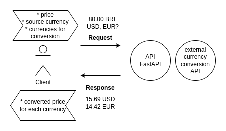

# Currency Converter API

A FastAPI-based API for converting product prices between currencies.

## Introduction

Currency Converter API is a project aimed at providing a simple yet effective solution for converting product prices between different currencies. With this API, users can easily input the price of a product in one currency and receive its value in other currencies.

## Features

- Convert product prices between various currencies.
- Simple API interface for easy integration into applications.
- FastAPI framework for efficient and scalable performance.

## Installation

To install and run the Currency Converter API locally, follow these steps:

1. Clone this repository to your local machine.
2. Navigate to the project directory.
3. Install dependencies using Poetry:

```bash
poetry install
```

Start the FastAPI server:

```bash
cd currency_converter_api
poetry run uvicorn main:app --reload
```

# Architecture Diagram



# API Documentation

For detailed information on how to use the API, refer to the interactive Swagger documentation available at `/docs` when the server is running.

# Contributing

Contributions are welcome! If you find any issues or have suggestions for improvements, feel free to open an issue or submit a pull request.

# License

This project is licensed under the MIT License.

Feel free to adjust the content as needed for your project.
